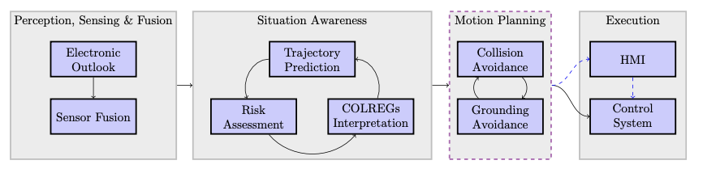

The central issue is straightforward: maritime navigation depends on situational awareness, but the systems used to support that awareness are growing faster than the human and software workflows that have to make sense of them.

## The operating environment is getting harder

As the world witnesses a surge in maritime activities, the need for reliable and precise navigation becomes increasingly critical. [UNCTAD's Review of Maritime Transport 2024](https://unctad.org/publication/review-maritime-transport-2024) shows continued growth in seaborne trade, while the growth of offshore wind farms, areas reserved for environmental conservation, and regions allocated for blue economy activities such as aquaculture is leading to more congested sea lanes.

Safe maritime navigation heavily relies on the navigator's ability to maintain [situational awareness](https://doi.org/10.1007/s13437-022-00264-4), a cognitive state that allows them to perceive and understand their surroundings and make informed decisions. Navigators maintain situational awareness by relying extensively on advanced sensor technologies and integrated navigation systems that perceive and interpret their environment.

## Bridge systems produce information, not understanding

Examples of such systems used to aid understanding of the surrounding environment are GPS, AIS, ARPA, and ECDIS. Information from these systems is used to avoid collisions and navigate efficiently, but also to understand and react appropriately to a dynamic and potentially unpredictable maritime environment.

According to [EMSA's navigation accident analysis](https://safety4sea.com/emsa-analysis-of-navigation-accidents/) and its [public summary report](https://safety4sea.com/wp-content/uploads/2022/09/EMSA-EMCIP-Navigation-Accidents-2022_09.pdf), a large share of investigated navigation accidents are linked to human action. Several of the areas of concern highlighted in that analysis are attributed, one way or another, to factors related to inefficient information management and lack of situational awareness. Examples mentioned in the study are information coordination, information availability, use of navigation equipment, and multitasking.

| Areas of Concern | Nr. CF |
| --- | ---: |
| BRM coordination | 94 |
| Use of electronic equipment | 94 |
| Work methods and supervision | 63 |
| BRM resource availability | 63 |
| External communications | 53 |
| Coordination with third parties | 48 |
| Maintenance implementation on board | 41 |
| Alarm setup | 41 |
| Internal communications | 31 |
| Use of equipment | 26 |
| Multitasking | 26 |
| SMS implementation on board | 14 |
| Total | 594 |

*The Areas of Concern reported for "Work/operation methods" [European Maritime Safety Agency, Safety Analysis of EMCIP Data - Navigation Accidents (2022)](https://safety4sea.com/wp-content/uploads/2022/09/EMSA-EMCIP-Navigation-Accidents-2022_09.pdf).*

These findings provide the grounds to suggest to the maritime industry that enhancing situational awareness is quite likely a catalyst in improving navigational safety and reducing the number of accidents.

## More onboard technology can increase workload

The maritime domain has in the past been a main field of automation and digitalization, with vessels being continuously equipped with the latest technologies, sensors, and software solutions. The research community, along with the maritime industry, has come to realize that a possible technological reply to navigation accidents is increasing the amount of integrated systems.

Unfortunately, despite the increased number of sensors and systems found on ships, [EMSA's annual overviews of marine casualties and incidents](https://www.emsa.europa.eu/accident-investigation-publications/annual-overview.html) do not show a decline between 2014 and 2022 that would support the notion that more technology equals more safety.

<figure>

<figcaption>Evolution of number of marine casualties and incidents involving at least one EU flagged ship. Adjusted from <a href="https://safety4sea.com/wp-content/uploads/2022/09/EMSA-EMCIP-Navigation-Accidents-2022_09.pdf" target="_blank" rel="noopener">European Maritime Safety Agency, Safety Analysis of EMCIP Data - Navigation Accidents (2022)</a>.</figcaption>
</figure>

This paradoxical finding challenges the notion that more technology equals more safety. Accidents are often wrongly attributed to human factors when they should be attributed to information overload. Studies on [bridge alerts](https://www.cambridge.org/core/services/aop-cambridge-core/content/view/660EF2AF29E4A7A3B34FC708F89BB392/S0373463319000687a.pdf/div-class-title-the-impact-of-bridge-alerts-on-navigating-officers-div.pdf) and [alarm overload](https://www.lr.org/en/knowledge/horizons/october-2024/alarm-overload-threatens-maritime-safety/) point in the same direction, showing how hard it is to maintain situational awareness in the maritime domain amidst a vast amount of available information.

Future integration of multi-sensor technologies should therefore happen within a greater autonomy context, where a system of systems jointly processes multi-sensor information, summarizes it, and returns fused feedback, contributing to enhanced situational awareness without increasing cognitive load.

## Cyber failure now sits inside the safety problem

The cyber threat is an emerging concern in the international maritime industry. As ships become more technologically integrated, the exposed surface available to perform cyberattacks and disable ship and shore-based technology is expanding. The advent of maritime autonomous surface ships has blurred the traditional tasks and functions carried out by humans, further increasing the susceptibility to such threats.

<figure>
  
  <figcaption>Diagram of GNSS spoofing. Source: Justus Joachim Imkampe, <a href="https://www.riskintelligence.eu/analyst-briefings/maritime-navigation-under-threat" target="_blank" rel="noopener">"Maritime navigation under threat: GNSS spoofing raises security concerns"</a>, Risk Intelligence, 9 October 2023.</figcaption>
</figure>

Examples of such cyberattacks are [GNSS spoofing and jamming, ECDIS manipulation, and AIS interference](https://doi.org/10.7225/toms.v10.n02.w08). Among them, attacks against GNSS constitute the most important threat to maritime navigational safety due to the critical reliance on this technology to provide accurate position, navigation, and timing. [C4ADS documented thousands of suspected spoofing incidents affecting civilian vessel navigation systems](https://c4ads.org/reports/above-us-only-stars/), highlighting the emergence of such attacks as viable and disruptive strategic threats to maritime safety.

<figure>
  
  <figcaption>Illustration of spoofed vessel position and track. Source: Justus Joachim Imkampe, <a href="https://www.riskintelligence.eu/analyst-briefings/maritime-navigation-under-threat" target="_blank" rel="noopener">"Maritime navigation under threat: GNSS spoofing raises security concerns"</a>, Risk Intelligence, 9 October 2023.</figcaption>
</figure>

ARPA is an additional essential aid to ensure safe navigation, and its integrity is also vulnerable to cyberattacks. In light of those facts, conducting research towards understanding cyber-threats and developing new cybersecurity measures that ensure safe navigation is becoming increasingly important.

## The problem statement

For this discussion, navigational safety is limited to maintaining situational awareness within a multi-sensor perception system. Maritime situational awareness requires remaining aware of the own ship's position while precisely sensing the surrounding environment, and can be decomposed into two crucial components:

- position, navigation, and timing
- perception

The first branch of work concerns reliable position, navigation, and timing. A systematic analysis of information dependencies in the multi-sensor platform is proposed to suggest forms of sensing redundancy or deficiency. On the basis of findings from the analysis, multi-sensor fusion is used to investigate alternative positioning systems independent of GNSS.

Moving on to the next research segment, the work aims to establish an independent and automated second line of defence against cyberattacks targeting navigational equipment. Instead of focusing on direct detection of attacks on a dedicated sensor, the methods focus on detecting the impact that attacks have on the coherence of presented information across multiple instrumentation.

Lastly, the third part of the work contributes to reliable perception. It proposes a [multi-sensor fusion](https://doi.org/10.1007/s40815-020-00963-1) framework that enables the efficient and intelligent processing of large volumes of heterogeneous information from a multi-sensor platform. The system perceives its surroundings and provides a fused navigation-native map-view representation of the situation that can be used to enhance navigational safety.

This discussion highlights the following research questions:

- To which degree can the existing technology and regulations correspond to cyber-resilient navigation, which improvements are necessary, and how can we facilitate them?
- How can we safeguard the integrity of situational awareness against cyberattacks or component failures?
- How can we facilitate new technology integration, such as camera systems, in a way that will enhance situational awareness and reduce cognitive load?

## Why this framing matters

The prime metaphorical and literal vessel of this work is the ShippingLab project, an initiative focused on the advancement of autonomous shipborne mobility and smart shipping solutions within the Danish maritime industry. The central objective of the project is to showcase unmanned operation through the GreenHopper, a small harbor ferry operating in Aalborg.

The vessel was later retrofitted with autonomous capabilities and equipped with various sensors including cameras, radars, and LiDARs to enhance situational awareness of the autonomous system. Both partial and fully autonomous solutions are underpinned by a custom autonomy stack designed as a modular and comprehensive system.

*MASS architecture, taken from [Thomas Thuesen Enevoldsen, Informed Sampling-based Collision and Grounding Avoidance for Autonomous Marine Crafts (2023)](https://orbit.dtu.dk/en/publications/informed-sampling-based-collision-and-grounding-avoidance-for-aut/).*

The perception component, which is the main scope of the current research, combines all sensory data to produce an integrated understanding of the ship's surroundings. Thereafter, situational awareness processes this information to anticipate future trajectories of other agents, assess risks, and make predictions. Motion planning formulates collision and grounding avoidance deviations that result in safe, rule-compliant trajectories.
